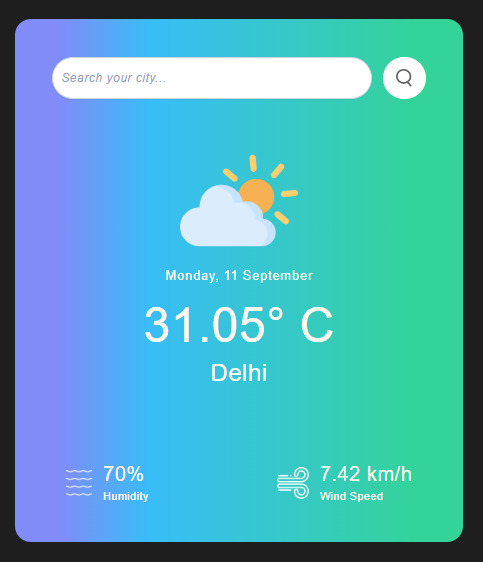

# Weather App

WeatherApp is a React-based weather forecasting application that leverages Redux for state management and REST API to provide real-time weather information for locations around the world.


## Screenshots




## Features

- **Real-time Weather Data**: Get up-to-date weather information for any location worldwide.
- **Search by Location**: Enter a city name or ZIP code to get weather details for a specific area.
- **Detailed Weather Information**: View temperature, humidity, wind speed, and weather conditions.
- **User-Friendly Interface**: A clean and intuitive interface for easy navigation.
- **Responsive Design**: Access the app on various devices, including desktop and mobile.

## Run Locally

Clone this repository to your local machine:

```bash
  git clone https://github.com/vanshika105/WeatherApp.git
```

Navigate to the project directory:

```bash
  cd WeatherApp
```

Install dependencies

```bash
  npm install
```

Start the development server

```bash
  npm run start
```

Open your web browser and visit http://localhost:3000 to run the application locally.
## Usage/Examples

- Open the WeatherApp in your web browser.
- Enter the name of the city or ZIP code for which you want to check the weather.
- Click the "Search" button.
- View the weather details displayed on the screen.


## Tech Stack

- **React**: A JavaScript library for building user interfaces.
- **Redux**: A predictable state container for managing application state.
- **Tailwind CSS**: A utility-first CSS framework for styling the application.
- **REST API**: Used to fetch weather data from an external source.
- **HTML/CSS**: For structuring and styling the application.


## API Reference

WeatherApp uses the following REST API to fetch weather data:

- API Name: OpenWeatherMap API
- API Documentation: [OpenWeatherMap API Documentation](https://openweathermap.org/current)
To use this application, you may need to sign up for an API key from OpenWeatherMap and replace the placeholder API key in the code with your own.
